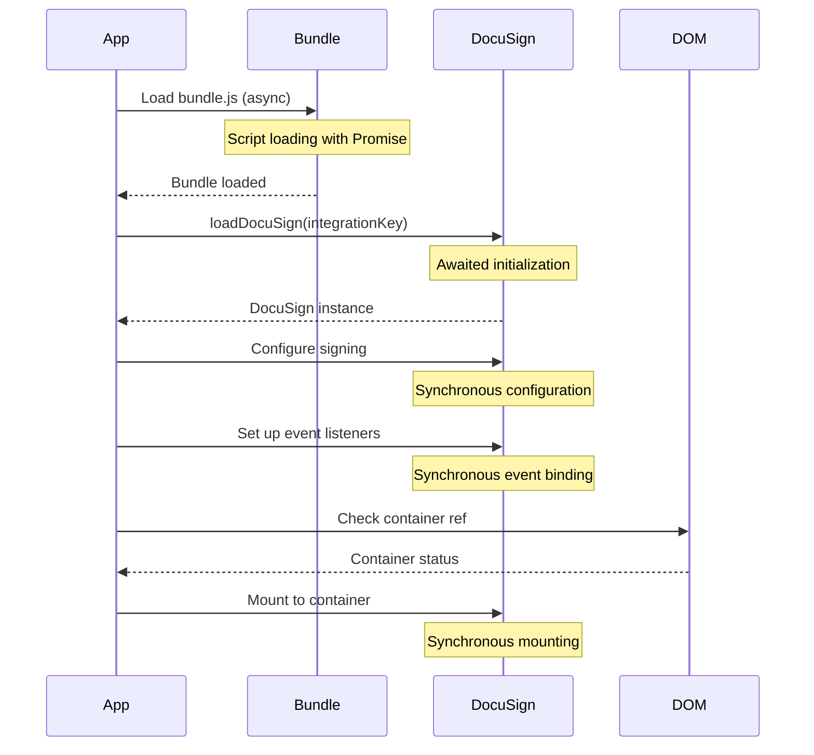

# DocuSign Focused View - Initialization Sequence Analysis

## Overview
This report analyzes the exact sequence and timing of the DocuSign focused view initialization in the Node.js sample application, with particular attention to synchronization and potential race conditions.

## Initialization Sequence

### 1. Bundle Loading Phase
```javascript
const loadDocuSignBundle = (): Promise<void> => {
  return new Promise((resolve, reject) => {
    const script = document.createElement('script');
    script.src = 'https://js.docusign.com/bundle.js';
    script.async = true;
    script.onload = () => resolve();
    script.onerror = () => reject(new Error('Failed to load DocuSign bundle'));
    document.body.appendChild(script);
  });
};
```

**Timing Characteristics:**
- Asynchronous operation (`async: true`)
- Returns a Promise that resolves when the script loads
- First step in the sequence
- Potential race condition: Multiple simultaneous component instances could try to load the bundle

### 2. Integration Key Loading Phase
```javascript
const docusign = await window.DocuSign.loadDocuSign(integrationKey);
```

**Timing Characteristics:**
- Awaited operation
- Can only start after bundle.js is fully loaded
- Returns a Promise that resolves with the DocuSign instance
- No race condition: Protected by the previous await

### 3. Signing Configuration Phase
```javascript
signing = docusign.signing({
  url: signingUrl,
  displayFormat: 'focused',
  style: { ... }
});
```

**Timing Characteristics:**
- Synchronous operation
- Executes immediately after loadDocuSign resolves
- No race condition: Protected by the previous await

### 4. Event Listener Setup Phase
```javascript
signing.on('ready', () => {
  setIsLoading(false);
});

signing.on('sessionEnd', (event: any) => {
  if (event.status === 'completed') {
    onSuccess?.(event);
  } else if (event.status === 'cancelled') {
    onCancel?.();
  }
});
```

**Timing Characteristics:**
- Synchronous operation
- Must happen before mounting
- No race condition: Event listeners are queued before any events can fire

### 5. Mounting Phase
```javascript
if (containerRef.current) {
  signing.mount('#docusign-focused-container');
}
```

**Timing Characteristics:**
- Synchronous operation
- Final step in the sequence
- Potential race condition: Container might not be ready in the DOM

## Complete Sequence Flow



## Race Condition Prevention

1. **Bundle Loading**
   ```javascript
   if (!window.DocuSign) {
     await loadDocuSignBundle();
   }
   ```
   - Checks if bundle is already loaded
   - Prevents multiple simultaneous loading attempts
   - Uses await to ensure completion

2. **Container Mounting**
   ```javascript
   if (containerRef.current) {
     signing.mount('#docusign-focused-container');
   }
   ```
   - Verifies container existence before mounting
   - Uses React ref for reliable DOM reference
   - Prevents mounting to non-existent container

3. **Cleanup Handling**
   ```javascript
   return () => {
     if (signing && typeof signing.unmount === 'function') {
       signing.unmount();
     }
   };
   ```
   - Safely handles component unmounting
   - Prevents memory leaks
   - Handles interrupted initialization

## Key Timing Guarantees

1. **Sequential Execution**
   - Bundle loading must complete before loadDocuSign()
   - loadDocuSign() must complete before signing configuration
   - Event listeners must be set before mounting

2. **Asynchronous Boundaries**
   - Bundle loading is the only truly asynchronous operation
   - All subsequent operations are synchronous or Promise-based
   - Each step waits for the previous step's completion

3. **Error Handling**
   - Each phase has proper error handling
   - Errors are caught and propagated appropriately
   - Loading states reflect current initialization phase

## Conclusion
The initialization sequence is well-structured with proper synchronization. The only true asynchronous operation is the initial bundle loading, with all subsequent operations happening in a guaranteed sequence. Race conditions are properly handled through React refs, existence checks, and proper cleanup mechanisms. 