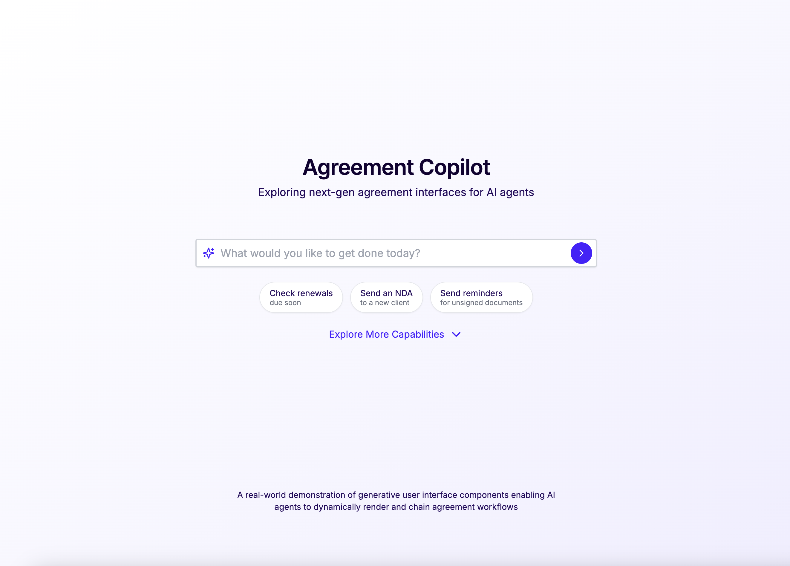

# Agreement Copilot

An experiment in generative interfaces: AI agents that build UIs and agreement workflows on demand. Using Docusign APIs to demonstrate how agents can replace static, pre-built interfaces with dynamic, intent-driven experiences.

Built for The Docusign Hackathon: Unlocked - *Unlock what's possible. Build the future of Agreements.*

<div align="center">
  
  
  [](https://youtu.be/vXbhFzUtfRs)
</div>

## The Vision

Traditional agreement interfaces are static and rigid, forcing users to navigate complex menus and pre-defined processes. Agreement Copilot takes a different approach:

- 🎯 **Just describe what you need** - "Send an NDA" or "Remind pending signers"
- 🔄 **AI generates the perfect interface** - Custom React components render exactly what's needed
- 🤖 **Agent handles the complexity** - Managing templates, recipients, deadlines, and reminders
- 👥 **Humans stay in control** - You make the decisions, we handle everything else

This turns Docusign from a destination into an invisible layer. Employees manage agreements through natural language, customers get tailored signing experiences, all powered by Docusign without the traditional UI friction.

> 💡 Want to build your own AI-powered agreement workflows? Check out our [Agent Tools](https://github.com/ryanmio/docusign-agent-tools) toolkit!

## Docusign Stack
- **eSignature API**
  - Core operations for agreement management
  - Secure signing workflows
- **Docusign Connect Webhook**
  - Real-time updates on envelope status
- **Navigator API**
  - Advanced document analysis
  - Semantic search capabilities

## Tech Stack
- **Frontend**: Next.js 14 (App Router)
- **AI**: Vercel AI SDK, OpenAI
- **Auth**: Supabase
- **UI**: React, Dynamic Component Generation
- **APIs**: Docusign eSignature & Navigator

## How It Works

Agreement Copilot demonstrates a new way to build with Docusign - where instead of coding against APIs, developers deploy AI agents that dynamically generate both the interface and workflow for any agreement task.

### Key Innovation
Traditional integrations require pre-building every UI element and mapping it to specific Docusign API calls. Our approach is different - the AI agent dynamically generates both the UI components and API calls based on the user's goal. For developers, this means adding complex agreement workflows becomes as simple as providing the agent with tools and flexible react components and letting the agent handle the rest.


Agreement Copilot Diagram:

```sql
+-----------------+           +-----------------------+           +----------------------+           +---------------------------+           +------------------+
|     User        |           |   React Chat UI       |           |       AI Agent       |           |       Tools Library        |           |   Backend & APIs  |
|-----------------|           |-----------------------|           |----------------------|           |---------------------------|           |------------------|
| - Input Command |           | - Send Input to AI    |           | - Analyze Request    |           | - prepareDocument Tool    |           | - Docusign REST   |
| "Prepare & send |           |   Backend API         |           | - System Instructions|           | - sendDocument Tool       |           |   API             |
| NDA to Acme"    |           |                       |           | - Call Tools         |           | - summarizeContract Tool  |           | - Docusign Navigator|
|                 |           |                       |           |                      |           |                           |           | - Supabase Auth   |
+-----------------+           +-----------------------+           +----------------------+           +---------------------------+           +------------------+
         |                             |                                   |                                |                                   |
         |-- User Input -------------> |                                   |                                |                                   |
         |                             |-- Send Request -----------------> |                                |                                   |
         |                             |                                   |-- Authenticate User ---------->|                                   |
         |                             |                                   |  (via Supabase Auth)           |                                   |
         |                             |                                   |                                |                                   |
         |                             |                                   |-- Call Tool: prepareDocument -->|                                   |
         |                             |                                   |                                |                                   |
         |                             |                                   |                                |-- Call Docusign REST API -------> |
         |                             |                                   |                                |   Prepare NDA Document           |
         |                             |                                   |                                |<-- NDA Details Returned -------- |
         |                             |<--------------------------------- prepareDocument Results ---------+                                   |
         |                             |                                   |                                |                                   |
         |                             |                                   |-- Call Tool: sendDocument ----->|                                   |
         |                             |                                   |                                |                                   |
         |                             |                                   |-- Authenticate User ---------->|                                   |
         |                             |                                   |  (via Supabase Auth)           |                                   |
         |                             |                                   |                                |                                   |
         |                             |                                   |                                |-- Call Docusign REST API -------> |
         |                             |                                   |                                |   Send NDA to Recipient          |
         |                             |                                   |                                |<-- Sending Status Returned ----- |
         |                             |<--------------------------------- sendDocument Results -----------+                                   |
         |                             |                                   |                                |                                   |
         |                             |<-- AI Compiles Results ----------|                                |                                   |
         |                             |                                   |                                |                                   |
         |<----------------------------- Render Component ----------------|                                |                                   |
         |    (DocumentStatusView)      |                                |                                |                                   |
         |                             |                                   |                                |                                   |
         |                             |                                   |                                |                                   |
         |                             |<-------------------------------- Docusign Connect Webhook --------|                                   |
         |                             |                                   |   (Real-time Status Update)    |                                   |
         |                             |                                   |                                |                                   |
         |                             |<-- Update React Component -------|                                |                                   |
         |                             |   (Real-time Updates)            |                                |                                   |
+-----------------+           +-----------------------+           +----------------------+           +---------------------------+           +------------------+
|                 |           |                       |           |                      |           |                           |           |                  |
|   User Action   |           | React Updates with    |           | Orchestrates Workflow|           | Executes Specific Tasks  |           | Docusign/APIs    |
|   Completed     |           | DocumentStatusView    |           | & Tool Invocation    |           |                           |           |                  |
+-----------------+           +-----------------------+           +----------------------+           +---------------------------+           +------------------+
```


Sequence of events:
```sql
+----------------+       +--------------------+       +--------------------+       +---------------------------+       +--------------------+
|    User & UI   |       |  Chat/AI System    |       |    Tools Library    |       | Docusign & External       |       |  Callback/Webhook  |
|                |       |                    |       |                    |       | Services                  |       |                    |
| "Show me the   |       | Receive Request:   |       | Call Tool:          |       | Handle API Calls:         |       | Docusign Connect:  |
| details of     |       | - From React UI    |       | - displayDocument  |       | - eSignature Details      |       | - Notify Server    |
| Envelope #123" |       | Merge instructions |       | - Authenticate User|       | - Document Metadata       |       | - Update AI        |
|                |       | - Route to AI Model|       | - Fetch Metadata   |       | - Contract Insights       |       | - Real-time Updates|
+----------------+       +--------------------+       +--------------------+       +---------------------------+       +--------------------+
        |                          |                          |                                |                               |
        |  (1) User Input          |                          |                                |                               |
        +------------------------->|                          |                                |                               |
                                   | (2) AI Decides to        |                                |                               |
                                   | Call Tool:               |                                |                               |
                                   | "displayDocumentDetails" |                                |                               |
                                   +------------------------->| (3) Authenticate User         |                               |
                                                              | - Check Session in DB          |                               |
                                                              |                                |                               |
                                                              | (4) Call Docusign REST API     |                                |
                                                              +----------------------------->  |                               |
                                                                                               | (5) Fetch Envelope Metadata   |
                                                                                               | - Status, PDFs, Recipients    |
                                                                                               |                               |
                                                                                               +-----------------------------> |
                                                                                                                               |
                                                              |<----------------------------+ (6) Return Data                 |
                                   |<------------------------+ "Envelope Metadata"         |                               |
        +------------------------->| (7) Format Response      |                                |                               |
        | Render React Component:  | - Render React Component |                                |                               |
        | DocumentDetailsView      | "DocumentDetailsView"    |                                |                               |
        |                          |                          |                                |                               |
+----------------+       +--------------------+       +--------------------+       +---------------------------+       +--------------------+
```


React Rendering:
```sql
+-----------------------+
|      Chat Window      |
|-----------------------|
|  +------------------+ | 
|  | Message Stream   | |  
|  |------------------| | 
|  | User: Show me    | | 
|  |  Envelope #123   | | 
|  | AI: Here are the | | 
|  |  details:        | | 
|  |                  | | 
|  | [DocumentDetails]| | <- React Component dynamically rendered
|  +------------------+ | 
+-----------------------+

Flow:
1. User Message -> Chat Agent generates a response:
   - Specification: { toolName: "displayDocumentDetails", envelopeId: 123 }

2. Chat Agent Response ->
   - Embedded Tool Invocation: "displayDocumentDetails"

3. React Integration:
   - UI detects `toolName` in the AI message.
   - Dynamically mounts `DocumentDetailsView` React component.

4. React Component:
   - Uses `props` such as `envelopeId` to fetch/render data.
   - Interactivity: User clicks within the component, triggering new tool calls (e.g., resend document).

```

Simplified Tool Call
```sql
User/UI         Chat Agent          Tools                Docusign/Database
   |                 |                 |                           |
   |--Request-------->|                 |                           |
   |  "Show me        |                 |                           |
   |  Envelope #123"  |                 |                           |
   |                 |--Call Tool------>|                           |
   |                 | "displayDocumentDetails(envelopeId=123)"    |
   |                 |                 |--Fetch Data--------------->|
   |                 |                 |                           |
   |                 |                 |<--Return Data-------------|
   |                 |<--Result---------|                           |
   |                 | "Envelope #123 Details"                     |
   |<--Render--------|                 |                           |
   | "Display React Component with Data"                           |
   |                 |                 |                           |
```